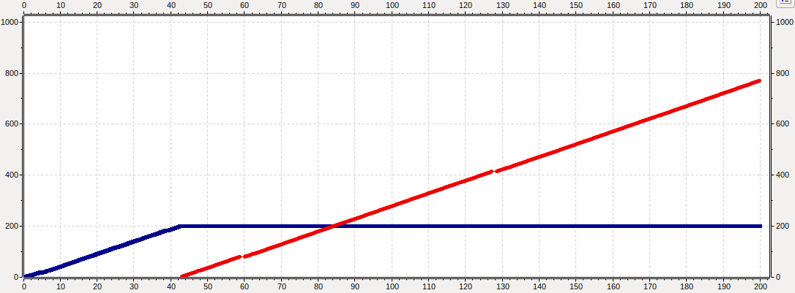
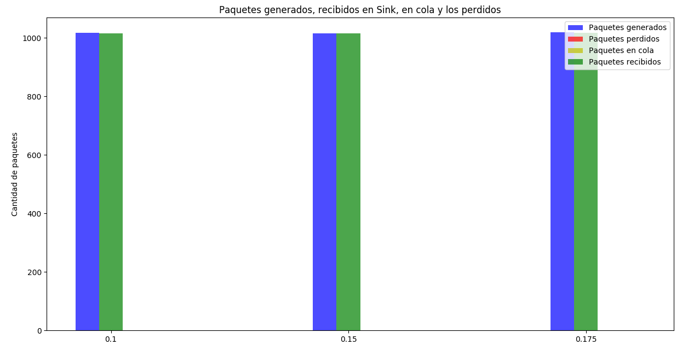
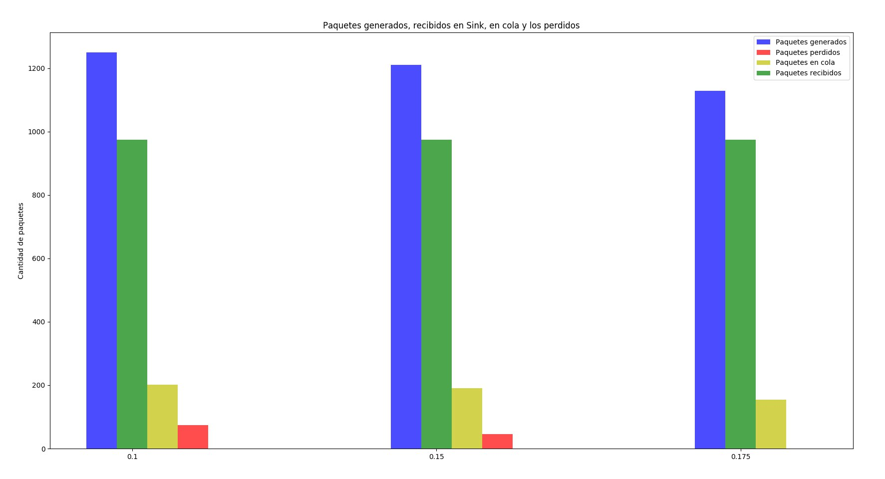

# Análisis de tráfico de red bajo tasas de datos acotadas y tamaño de buffers limitados
-----

# Indice 
1. Introducción

2. Composición de la Red

3. Análisis de una Red sin control de congestión ni flujo

    3.1 Caso de Estudio 1
    
    3.2 Caso de Estudio 2

4. Algoritmo de Control de Congestion

    4.1 Caso de Estudio 1
    
    4.2 Caso de Estudio 2

5. Conclusión

## Resumen

## Introducción
Con la existencia de las computadoras surgió la necesidad de compartir información entre las mismas, como consecuencia surgieron múltiples redes de diferentes tecnologías, tamaños (entre otros) para lograrlo. Por lo que en este análisis abarcaremos como tratar los diversos conflictos (control de flujo y congestión) que pueden aparecer en la comunicación de una red simple diseñada y simulada en Omnet++.

Se simularan varios casos de estudio y obtendrán
conclusiones sobre el comportamiento de la red.

## Analisis de una Red sin control de congestión ni flujo
Trabajaremos con una red constituida por tres módulos.

Un nodoTx contiene por un generador y una cola, llamada cola de nodoTx. 

Un nodoRx formado por un sink y una cola, llamada cola del nodoRx.

Ambos nodos están conectados por un camino de una sola mano desde el NodoTx al NodoRx, el nodo que los conecta es otra cola que llamaremos cola de datos.

### Caso de estudio 1

**Intervalos usados 0.1 - 0.15 - 0.175**

Con un **intervalo de generación de exponential(0.1)** el 99.5% de los paquetes generados fueron recibidos por la cola de datos. Mientras que el 50.42% fueron procesados en el Sink, mientras que el 38.9% de los paquetes restantes fueron perdidos, debido a la falta de espacio en la cola del nodo receptor. El otro 10.68% quedaron pendientes para ser procesados.

Al cambiar el **intervalo a exponential(0.15)** se generan menos paquetes por aumentar el tiempo de generación en NodeTx. El 100% de los paquetes generados fueron enviados a la Queue, pero solo el 76.4% de los recibidos fueron procesados por el receptor. En total se perdieron 8.2% de esos paquetes de la Queue al receptor (NodeRx).

Cuando probamos con un **intervalo de exponential(0.175)** dejamos de perder paquetes entre la Queue y el receptor a causa de aumentar el tiempo de generación de paquetes en NodeTx. Sin embargo el Sink pudo procesar un 88% de los paquetes.

Luego de analizar estos tres intervalos, nos damos cuenta que tenemos un problema de flujo, causado por un emisor que genera muchos mas paquetes de los que puede procesar el receptor.
A medida que el intervalo de generación aumentaba se producía una mejora de porcentaje de paquetes que podía procesar el receptor, pero a costa de enviar menos cantidad de paquetes. 

### Caso de estudio 2

Antes de empezar con el análisis del caso 2, cabe recalcar que los porcentajes de los paquetes procesados, perdidos, y en cola van a ser los mismos que el caso 1, ya que los cuellos de botellas son del mismo tamaño, pero ubicados en distintas partes de la red. 

Con un **intervalo de generación de exponential(0.1)** el 60.5% de los paquetes generados fueron recibidos por la cola de datos, a diferencia del caso 1, donde se recibieron el 99.5% de los paquetes. 

Al cambiar el **intervalo a exponential(0.15)** el 91.7% de los paquetes generados fueron enviados a la cola de datos.

Por ultimo, al cambiar el intervalo a **intervalo a exponential(0.175)** vemos que no se pierde ningun paquete y que la cola de datos recibe todos los paquetes que se generan.

Luego de haber analizado este caso, se ve claramente que tenemos un problema de congestión, causado por un cuello de botella en la cola de datos, ya que procesa muy lento los paquetes que recibe, esto causa que se llene su buffer.

#### Ilustracion de estadísticas caso 1 y caso 2

El siguiente grafico muestra como la cola de datos y la cola de nodoRx se llenan rápidamente (linea azul) y empiezan a perder paquetes (linea roja) con un **intervalo de generación de exponential(0.1)**. Ya que los cuellos de botellas son del mismo tamaño obtenemos el mismo grafico en ambos casos.

## Algoritmo de Control de Congestion

Los siguientes análisis se harán sobre la misma red descripta anteriormente pero con un adición de un canal de retorno desde el nodeRx al nodeTx para que el receptor pueda acusar información que regule la tasa de transmisión (feedback). 

Si la red se satura comenzará a descartar paquetes, que tendrán que ser retransmitidos, lo cual puede incrementar aún más la saturación de la red. Para poder solucionar este problema se implementó un algoritmo basado en *TCP Tahoe*, con algunas diferencias,si bien ambos comparten que cada vez que ocurre un Timeout vuelven a arrancar de "cero" , en vez de cambiar el volumen de datos que el emisor va a enviar a continuación se modifica la frecuencia con la que se envían los paquetes. Para lograr esto se utiliza una variable denotada con el nombre de **speed**. Cuando se programa el envio del siguiente paquete obtenemos la duración del mensaje anterior (cuyo valor oscila entre 0.785 y 1), se multiplica por la variable anteriormente mencionada y el resultado va a ser el tiempo que hay que esperar para poder enviar el siguiente mensaje, es decir, mientras más grande sea el valor de "speed" menor va a ser la frecuencia con la que se envían los paquetes, de forma reciproca, mientras más chico sea el valor de "speed" mayor va a ser la frecuencia.

Por otro lado el algoritmo toma en cuenta otro tipo de valores para determinar la constancia con la que se envían dichos paquete:

* Si el Tamaño del buffer restante del Receptor supera el 80% se duplica la velocidad (Dividir speed por dos).

* Si el Tamaño del buffer del Receptor restante se encuentra entre el 80% y el 30% speed se incrementa en 0.1.

* Finalmente si el tamaño del buffer restante del Receptor es menor a 30% la velocidad se divide en dos (Multiplicar speed por dos) 

En caso de que ocurra un Timeout a la variable "speed" se le asigna el valor de 30.0 que es el valor inicial cuando el algoritmo empieza.

### Caso de Estudio 1
**Intervalos usados 0.1 - 0.15 - 0.175**
Con un intervalo de generación de exponential(0.1) el 100% de los paquetes generados fueron recibidos por la cola de datos y procesados el nodoRx, lo cual implica que no hubo paquetes perdidos. 

A pesar de cambiar el intervalo de generación exponential por (0.15) o (0.175) se obtiene exactamente el mismo resultado que en el primer intervalo. Esto se puede observar en la siguiente ilustración.

#### Ilustracion de estadisticas caso 1 

También cabe destacar que en todos los casos el gráfico que representa el tamaño del buffer de NodeTx(color azul), el tamaño del buffer de NodeRx(color verde) y la velocidad(color rojo) son idénticos. Como podemos observar en los primeros 15 segundos, aproximadamente, el buffer de NodeTx se comienza a llenar rápidamente, ya que, la frecuencia con la que envía los paquetes es considerablemente lenta, pero entre los segundos 15 y 30 la constancia con la que se envían dichos paquetes es la máxima, por lo tanto el buffer decrece velozmente.

A partir de los 30 segundos en adelante se puede observar como la velocidad va disminuyendo y aumentando y el tamaño del buffer de NodeTx aumenta. Esto es devido a que el tamaño del buffer restante de NodeRx se encuentra entre el 30% y el 80% por lo tanto como se explico anteriormente la velocidad se incrementa en 0.1, pero rápidamente la velocidad disminuye cuando el tamaño restante es mayor al 80%. Esto da un efecto de olas en la velocidad.

El siguiente gráfico representa más de cerca la velociadad del gŕafico anterior. Aquí se puede visualizar de mejor forma el efecto de olas previamente dicho.

A pesar de que los casos coinciden en la mayoría de los datos, los siguientes gráficos representan el delay de los paquetes en el caso (0.1) y el (0.175). En el primer caso se puede observar como el crecimiento es casi constante con algunas pequeñas variaciones en donde el valor máximo alcanzado es casi 60, mientras que en el segundo caso si bien el delay se va incrementando lo hace der forma irregular y el valor máximo alcanzado es algo menor a 30.

Esto se debe a que al tener diferentes intervalos de generación, mientras más cantidad de paquetes se generen la red va a tener que procesar más paquetes por lo tanto el delay es mayor que el que pueda tener un intervalo de generación más grande.

### Caso de Estudio 2
**Intervalos usados 0.1 - 0.15 - 0.175**

Con un **intervalo de generación de exponential(0.1)** se pudieron recibir el 77.9% de los paquetes totales en el receptor, mientras que se perdieron solo un 5.92% de los paquetes, Ese 5.92% de paquetes perdidos fueron en la Queue, al igual que en el caso de estudio 2 sin el algoritmo, ya que este caso tiene un problema de congestión
A partir de ahora cada vez que nos referimos a paquetes perdidos, son los perdidos en la Queue por la congestión de la red. 

Al cambiar el **intervalo a exponential(0.15)** el 80.4% de los paquetes generados en el emisor llegaron al receptor, y solo un 3.71% de los paquetes fueron perdidos en la red. 

Y por ultimo, al cambiar el intervalo a **intervalo a exponential(0.175)** vemos que no se pierde ningún paquete, ya que, gracias a la velocidad de generación de paquetes, no se llega a saturar la red.

---
## Ilustracion de estadisticas con el algoritmo - Caso 1

---

## Ilustracion de estadisticas con el algoritmo - Caso 2

---

## Conclusión

