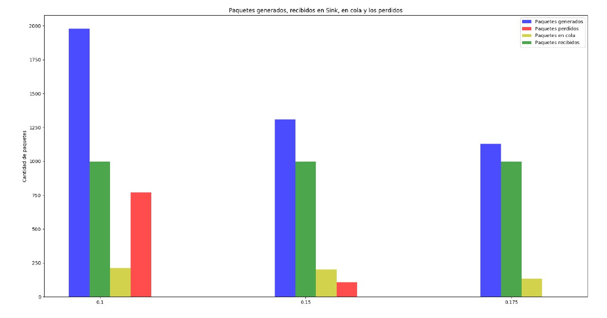

# Análisis de tráfico de red bajo tasas de datos acotadas y tamaño de buffers limitados
-----

# Indice 
1. Introducción

2. Composición de la Red

3. Análisis del comportamiento la red basado en el tamaño sus colas

	3.1 Caso de Estudio 1
	
	3.2 Caso de Estudio 2

4. Algoritmo de Control de Congestion

	4.1 Caso de Estudio 1
	
	4.2 Caso de Estudio 2

5. Conclusión

## Resumen

## Introducción
Explicar las diferentes casos de estudio que vamos a tratar y con que programa.

## Análisis del comportamiento la red basado en el tamaño sus colas
Explicar como esta conformada la red y dar datos importantes como el tamaño de los buffers de las respectivas colas.

### Caso de estudio 1

**Intervalos usados 0.1 - 0.15 - 0.175**

Con un **intervalo de generación de exponential(0.1)** el 99.5% de los paquetes generados fueron recibidos del emisor a la Queue. Mientras que el 50.42% fueron procesados en el Sink, mientras que el 38.9% de los paquetes restantes fueron perdidos, debido a la falta de espacio en la cola del nodo receptor. El otro 10.68% quedaron pendientes para ser procesados.

Al cambiar el  **intervalo a exponential(0.15)** se generan menos paquetes por aumentar el tiempo de generacion en NodeTx. El 100% de los paquetes generados fueron enviados a la Queue, pero solo el 76.4% de los recibidos fueron procesados por el receptor. En total se perdieron 8.2% de esos paquetes de la Queue al receptor (NodeRx).

Cuando probamos con un **intervalo de exponential(0.175)** dejamos de perder paquetes entre la Queue y el receptor a causa de aumentar el tiempo de generacion de paquetes en NodeTx. Sin embargo el Sink pudo procesar un 88% de los paquetes.

Luego de analizar estos tres intervalos, nos damos cuenta que tenemos un problema de flujo, causado por un emisor que genera muchos mas paquetes de los que puede procesar el receptor.
A medida que el intervalo de generacion aumentaba se producia una mejora de porcentaje de paquetes que podia procesar el receptor, pero a costa de enviar menos cantidad de paquetes. 

### Caso de estudio 2

Antes de empezar con el análisis del caso 2, cabe recalcar que los porcentajes de los paquetes procesados, perdidos, y en cola van a ser los mismos que el caso 1, ya que los cuellos de botellas son del mismo tamaño, pero ubicados en distintas partes de la red. 

Con un **intervalo de generación de exponential(0.1)** el 60.5% de los paquetes generados fueron recibidos del emisor a la Queue, a diferencia del caso 1, donde se recibieron el 99.5% de los paquetes. 

Al cambiar el **intervalo a exponential(0.15)** el 91.7% de los paquetes generados fueron enviados a la Queue

Por ultimo, al cambiar el intervalo a **intervalo a exponential(0.175)** vemos que no se pierde ningun paquete y que la Queue recibe todos los paquetes que se generan.

Luego de haber analizado este caso, se ve claramente que tenemos un problema de congestión, causado por un cuello de botella en la Queue, ya que procesa muy lento los paquetes que recibe, esto causa que se llene su buffer.

#### Fig 1. Ilustracion de estadisticas

## Algoritmo de Control de Congestion
Explicar como funciona el algoritmo que implementamos

### Caso de Estudio 1

### Caso de Estudio 2

## Conclusión
