# Análisis de tráfico de red bajo tasas de datos acotadas y tamaño de buffers limitados
-----

# Indice 
1. Introducción

2. Composición de la Red

3. Analisis de una Red sin control de congestion ni flujo

	3.1 Caso de Estudio 1
	
	3.2 Caso de Estudio 2

4. Algoritmo de Control de Congestion

	4.1 Caso de Estudio 1
	
	4.2 Caso de Estudio 2

5. Conclusión

## Resumen

## Introducción
Con la existencia de las computadoras surgió la necesidad de compartir informacion entre las mismas, como consecuncia surgieron multiples redes de diferentes tecnologias, tamaños (entre otros) para lograrlo. Por lo que en este análisis abarcaremos como tratar los diversos conflictos (control de flujo y congestion) que pueden aparecer en la comunicacion de una red siemple diseñada y simulada en Omnet++.

Se simularan varios casos de estudio y obtendrán
conclusiones sobre el comportamiento de la red.

## Analisis de una Red sin control de congestion ni flujo
Trabajaremos con una red constituida por tres modulos (Fig 1). 

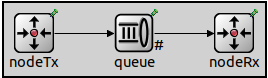

Un nodoTx contiene por un generador y una cola, llamada cola de nodoTx. 

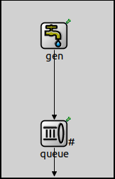

Un nodoRx formado por un sink y una cola, llamada cola del nodoRx.

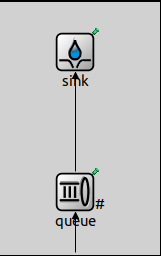

Ambos nodos estan conectados por un camino de una sola mano desde el NodoTx al NodoRx, el nodo que los conecta es otra cola que llamaremos cola de datos.

### Caso de estudio 1

**Intervalos usados 0.1 - 0.15 - 0.175**

Con un **intervalo de generación de exponential(0.1)** el 99.5% de los paquetes generados fueron recibidos del emisor a la Queue. Mientras que el 50.42% fueron procesados en el Sink, mientras que el 38.9% de los paquetes restantes fueron perdidos, debido a la falta de espacio en la cola del nodo receptor. El otro 10.68% quedaron pendientes para ser procesados.

Al cambiar el  **intervalo a exponential(0.15)** se generan menos paquetes por aumentar el tiempo de generacion en NodeTx. El 100% de los paquetes generados fueron enviados a la Queue, pero solo el 76.4% de los recibidos fueron procesados por el receptor. En total se perdieron 8.2% de esos paquetes de la Queue al receptor (NodeRx).

Cuando probamos con un **intervalo de exponential(0.175)** dejamos de perder paquetes entre la Queue y el receptor a causa de aumentar el tiempo de generacion de paquetes en NodeTx. Sin embargo el Sink pudo procesar un 88% de los paquetes.

Luego de analizar estos tres intervalos, nos damos cuenta que tenemos un problema de flujo, causado por un emisor que genera muchos mas paquetes de los que puede procesar el receptor.
A medida que el intervalo de generacion aumentaba se producia una mejora de porcentaje de paquetes que podia procesar el receptor, pero a costa de enviar menos cantidad de paquetes. 

### Caso de estudio 2

Antes de empezar con el análisis del caso 2, cabe recalcar que los porcentajes de los paquetes procesados, perdidos, y en cola van a ser los mismos que el caso 1, ya que los cuellos de botellas son del mismo tamaño, pero ubicados en distintas partes de la red. 

Con un **intervalo de generación de exponential(0.1)** el 60.5% de los paquetes generados fueron recibidos del emisor a la Queue, a diferencia del caso 1, donde se recibieron el 99.5% de los paquetes. 

Al cambiar el **intervalo a exponential(0.15)** el 91.7% de los paquetes generados fueron enviados a la Queue

Por ultimo, al cambiar el intervalo a **intervalo a exponential(0.175)** vemos que no se pierde ningun paquete y que la Queue recibe todos los paquetes que se generan.

Luego de haber analizado este caso, se ve claramente que tenemos un problema de congestión, causado por un cuello de botella en la Queue, ya que procesa muy lento los paquetes que recibe, esto causa que se llene su buffer.

#### Fig 1. Ilustracion de estadisticas caso 1 y caso 2

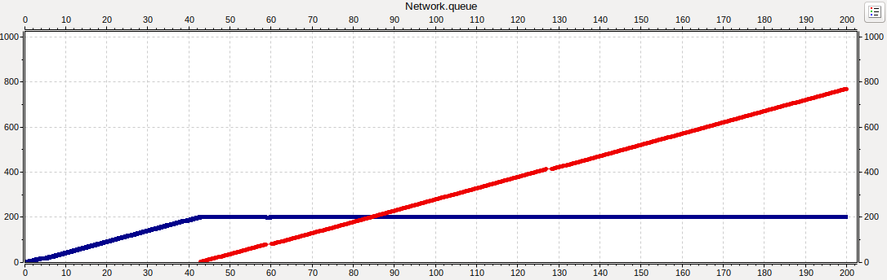

## Algoritmo de Control de Congestion

Los siguientes analisis se harán sobre la misma red descripta anteriormente pero con un adición de un canal de retorno desde el nodeRx al nodeTx para que el receptor pueda acusar información que regule la tasa de transmisión (feedback). 

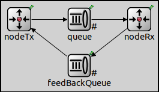

Si la red se satura comenzará a descartar paquetes, que tendrán que ser retransmitidos, lo cual puede incrementar aún más la saturación de la red. Para poder solucionar este poblema se implementó un algoritmo basado en *TCP Tahoe*, con algúnas diferencias,si bien ambos comparten que cada vez que ocurre un Timeout vuelven a arrancar de "cero" , en vez de cambiar el volumen de datos que el emisor va a enviar a continiación se modifica la frecuencia con la que se envían los paquetes. Para lograr esto se utiliza una variable denotada con el nombre de **speed**. Cuando se programa el envio del siguiente paquete obtenemos la duración del mensaje anterior (cuyo valor oscila entre 0.785 y 1), se multiplica por la variable anteriormente mencionada y el resultado va a ser el tiempo que hay que esperar para poder enviar el siguiente mensaje, es decir, mientras más grande sea el valor de "speed" menor va a ser la frecuencia con la que se envían los paquetes, de forma reciproca, mientras más chico sea el valor de "speed" mayor va a ser la frencuencia.

Por otro lado el algoritmo toma en cuenta otro tipo de valores para determinar la constancia con la que se envían dichos paquete:

* Si el Tamaño del buffer restante del Receptor supera el 80% se duplica la velocidad (Dividir speed por dos).

* Si el Tamaño del buffer del Receptor restante se encuentra entre el 80% y el 30% speed se incrementa en 0.1.

* Finalmente si el tamaño del buffer restante del Receptor es menor a 30% la velocidad se divide en dos (Multiplicar speed por dos) 

En caso de que ocurra un Timeout a la variable "speed" se le asigna el valor de 30.0 que es el valor inicial cuando el algoritmo empieza.

### Caso de Estudio 1
**Intervalos usados 0.1 - 0.15 - 0.175**

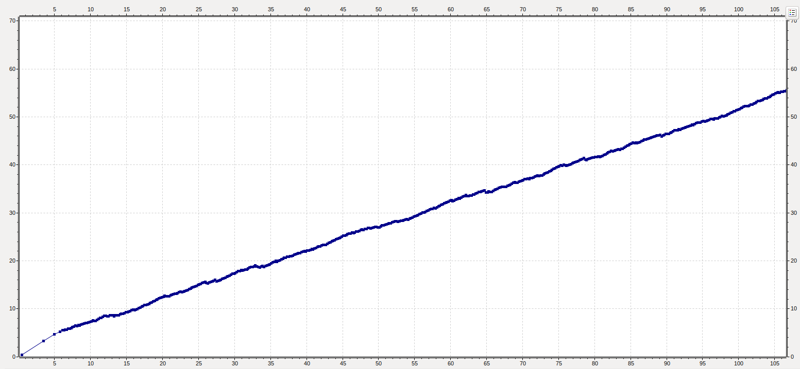
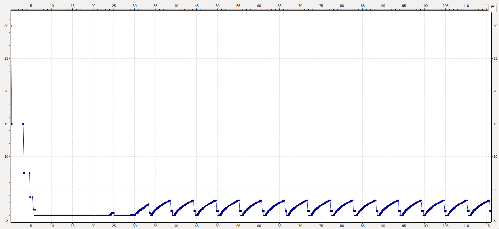
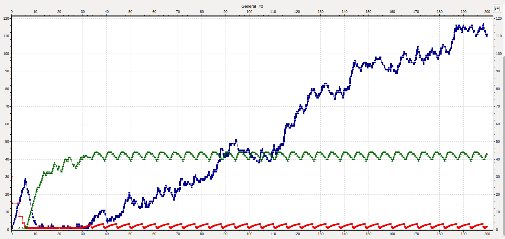

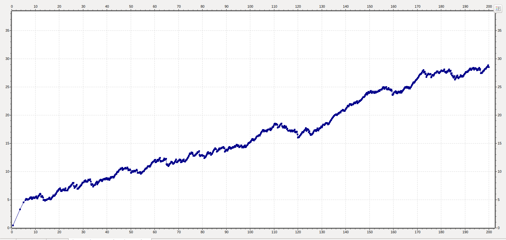
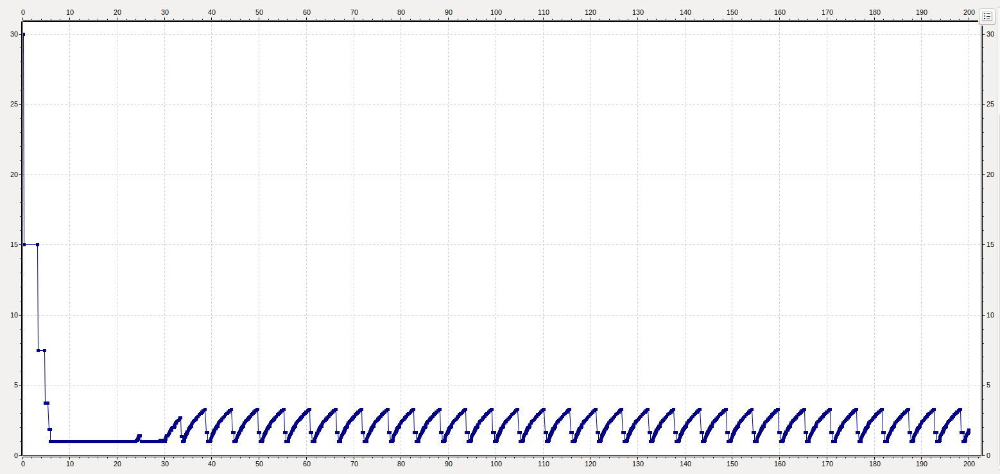
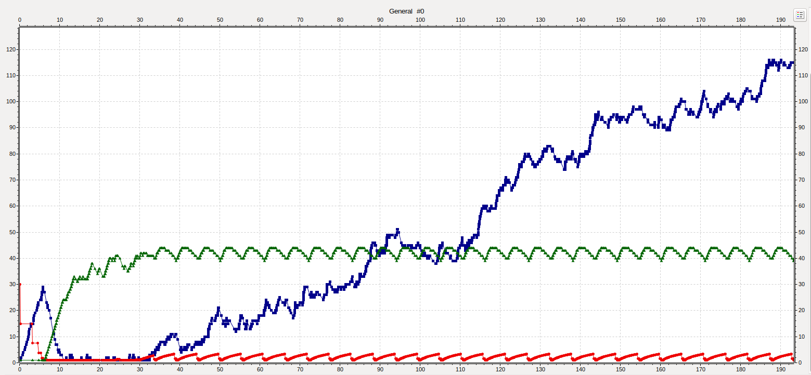

### Caso de Estudio 2
**Intervalos usados 0.1 - 0.15 - 0.175**

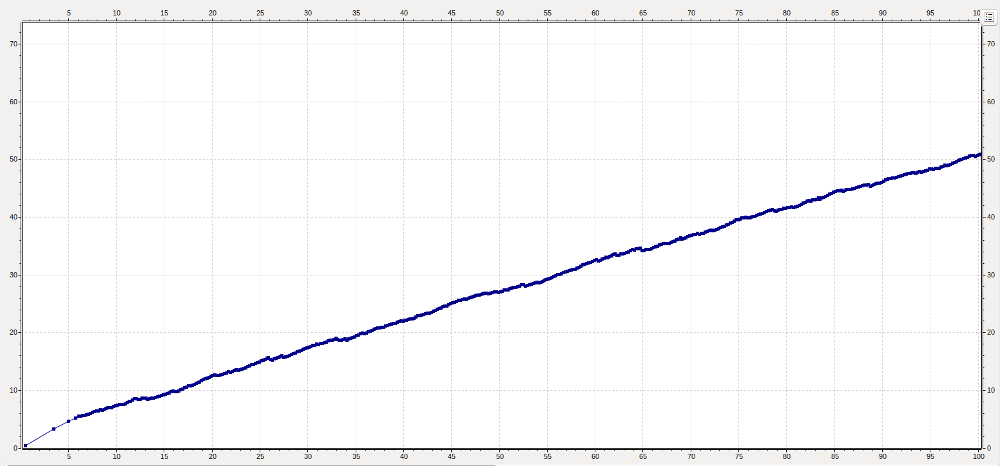
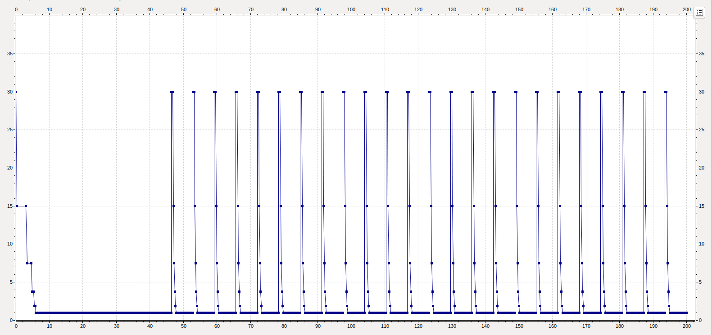
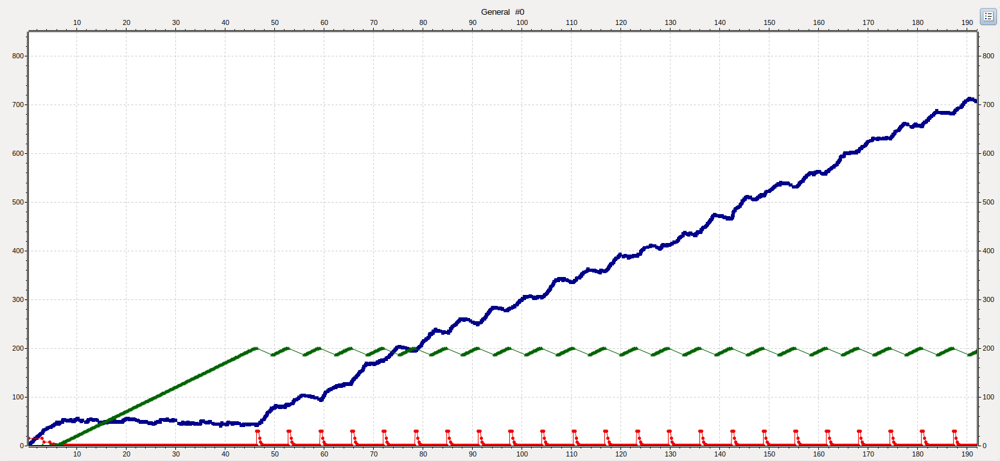

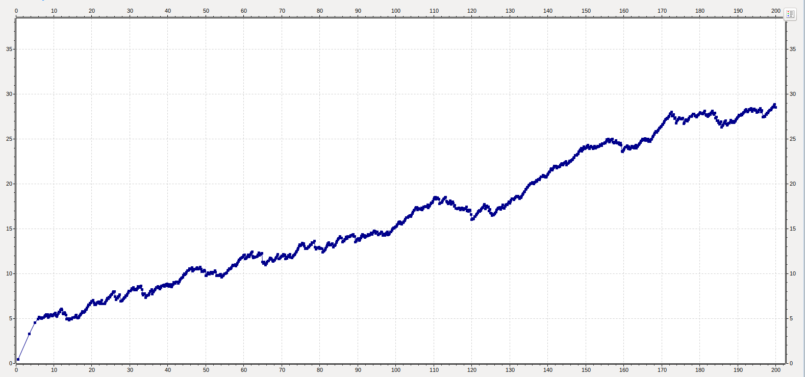
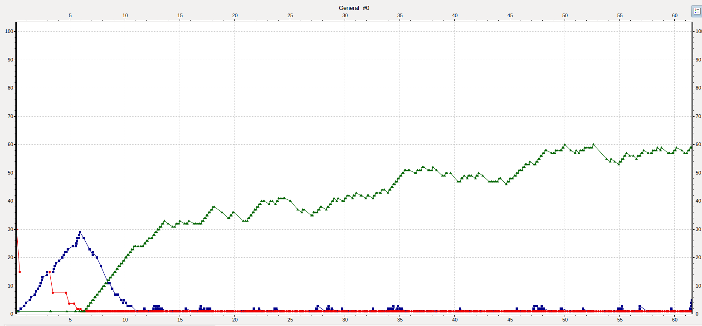

## Conclusión
